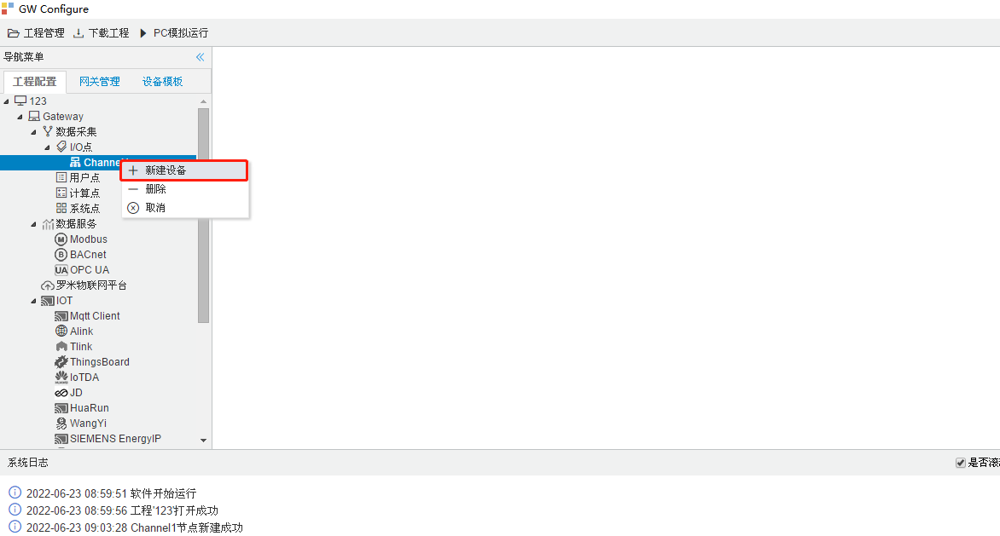
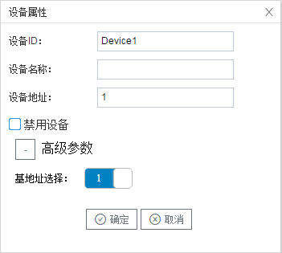
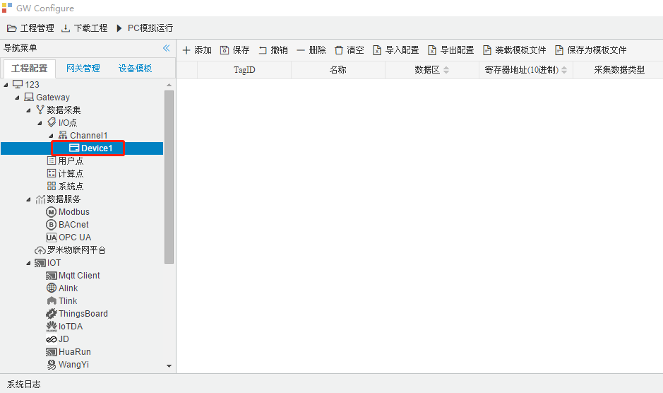

## 3.新建设备

右键"Channel1"后,如下图2-6-4所示   

图2-6-4 新建设备

点击"新建设备"，出现设备属性界面。

如下图2-6-5所示

 图 2-6-5  设备配置

- 设备名称：可自定义，默认为"Device X"（X为 1,2,3....），同一通道下，设备名称不可重复。
- 设备地址：Modbus仪表的站号，也称为表号，范围0~255。

配置完成后，"Channel1"下会多出一个新增设备”Device X“，如下图2-6-6 所示。

图2-6-6 Device1 子菜单栏

