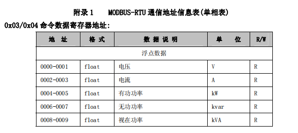
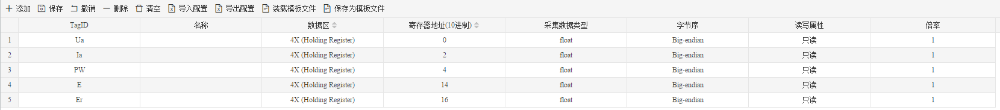
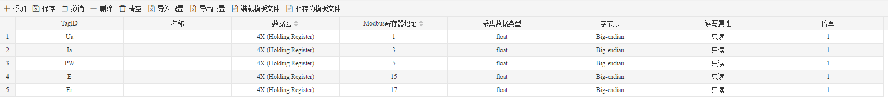

## 3.新建设备

右键"Channel1"后,如下图2-6-4所示   

图2-6-4 新建设备

点击"新建设备"，出现设备属性界面。

如下图2-6-5所示

 图 2-6-5  设备配置

- 设备ID：可自定义，默认为"Device X"（X为 1,2,3....），同一通道下，设备ID不可重复。
- 设备地址：Modbus仪表的站号，也称为表号，范围1-247。
- 基地址：默认为1。如果仪表的说明文档中，起始地址是0，可以将工程中基地址改为0，也可以将文档中的地址+1配置到工程当中

 图 2-7-6 斯菲尔单相表

上图所示为斯菲尔单相表部分寄存器地址信息表，从表中可看出电压所在的寄存器为保持寄存器中的0和1，即起始地址为0，所以此时可以将基地址切换成0，在配置具体数据点时以信息表中的地址配置。

也可保持基地址为1，将信息表中的地址+1之后填写到配置当中

配置完成后，"Channel1"下会多出一个新增设备”Device X“，如下图2-6-6 所示。

图2-6-6 Device1 子菜单栏

