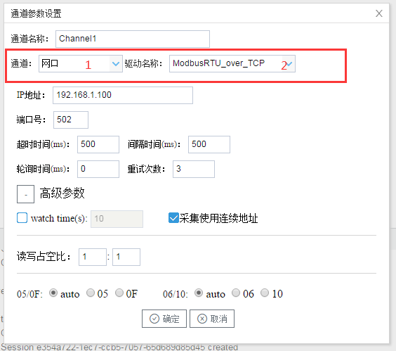

## 2.新建驱动

通道参数设置页面，在"通道"选择"网口"，在"驱动名称" 选中"ModbusRTU_over_TCP"。如下图2-6-2所示

  图2-6-2 通道参数设置

接着开始配置通道的采集信息，"ModbusRTU_over_TCP"默认配置是：

- 通道名称：Channel1，可自定义，不可重复，定义网关的采集通道；
- 通道：网口和串口两个选项，该驱动选择"网口"；
- 驱动名称： 选中"ModbusRTU_over_TCP"
- IP地址：填写仪表的IP地址，默认为"192.168.1.101"；
- 端口号：仪表的端口号，默认为502；
- 超时时间：自定义，默认3000ms;
- 间隔时间：可自定义，默认500ms;
- 轮询时间：可自定义，默认为0ms;
- 重试次数：可自定义，默认为3;
- 高级参数：
  - watch time: 设备故障时间，在当前通道下的设备通讯不上时，在watch time间隔内，不会再采集这个设 备。
  - 采集使用连续地址：默认勾选，网关会根据配置的Modbus地址的连续性自行组成报文统一采集。
  - 读写占空比：用于控制写操作与读操作的比率。占空比的默认设置为 1：1，这意味着每次读取操作对应一 次写入操作。即使在应用程序执行大量的连续写入操作时，也必须确保足够的读取数据处理时间。如果将 占空比设置为 1：10，则每次读取操作对应十次写入操作。如果未执行任何写入操作，则会连续处理读取 操作。

点击"确定"后，菜单栏"I/O点"下会新增通道"Channel1"，如下图2-6-3所示

 图2-6-3 Channel子菜单栏

