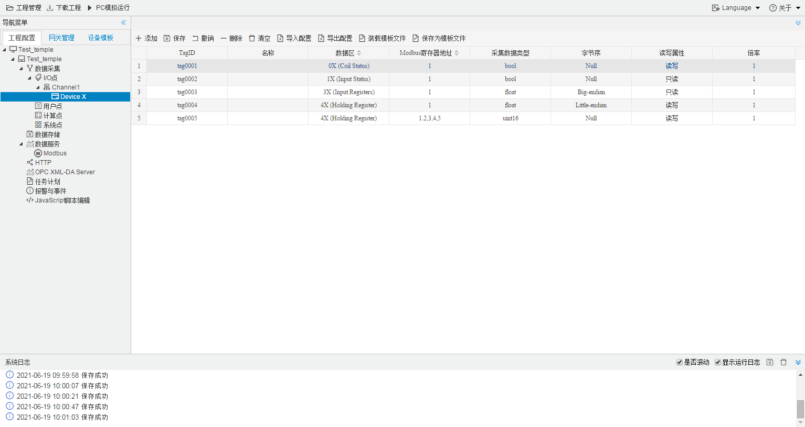

## 4.编辑采集点表

点击"Device1"，出现采集点配置界面，

- 名称：可自定义，默认为  tag0001，根据需要修改，设备采集点表内，名称不可重复；

- 描述：可自定义，描述信息，根据需要填写，可不填；

- 数据区：根据需要，选择"0X (Coil Status)"、"1X (Input Status)"、"3X (Input Registers)"和"4X (Holding Register)"。
  - 0X   (Coil Status)  数字量、**支持读写**（只有 0 和 1 值变化）   "采集数据类型" 只能设置bool
  - 1X (Input Status)  数字量、**只支持读**（只有 0 和 1 值变化）   "采集数据类型" 只能设置bool
  - 3X (Input Registers) 模拟量、**只支持读**（连续变化的类型）   
  - 4X (Holding Register) 模拟量、**支持读写**（连续变化的类型）  
  
- Modbus寄存器地址：可自定义，寄存器的地址，必填；

- 采集数据类型：根据需要选择读取的数据类型;

  - 数据类型：有bool、bit、uint16、int16、uint32、int32、float、double、uint64、int64；

  - 读取类型是"**bit**"，地址保留两位小数。例如 :0-7为第1个字节  8-15位第2个字节

    地址为"1.05"  读取字节地址为 1 上第5位  bit，取出的值为0；

    地址为"1.12"  读取字节地址为 1 上第12位  bit，取出的值为1；

    
  
- 字节序：由于计算机体系结构中，对于字节、字等的存储机制不同导致字节读取顺序肯定不同，所以需要选择既定的规则来解析数据。
  
  假设1234 对应的字节顺序：
  
  - "Big-endian"高地址在前  4321
  - "Little-endian"低地址在前  1234
  - "Big-endian byte swap"高地址在前并交换字节顺序   2143
  - "Little-endian byte swap"低地址在前并交换字节顺序  3412
  
- 读写属性：指定采集点的读写权限，一般有"读写"（可读可写）、"只读"（只能读取）和"只写"（只能写入）。根据需要，自己选择；

- "倍率"：通过放大或者缩小数据，可进行工程上的换算。根据需要填写，默认为1。

如下图2-6-7 所示  点击"添加" 后，创建名称为"tag0001"；数据区为"4X (Holding Register)"；Modbus寄存器地址为"1",；采集数据类型为 "float"；字节序为"Little-endian byte swap"；读写属性为"读写"；倍率："1"的采集点，最后点击"保存"。

​					

图2-6-7 tag点配置

