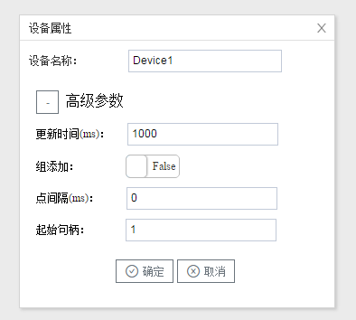

## 3.新建设备

右键"Channel1"后,如下图2-11-4所示   

图2-11-4 新建设备

点击"新建设备"，出现"设备属性""弹框。

如下图2-10-5所示

图2-11-5 设备配置

- 设备名称：可自定义，默认为"Device1"，同一通道下，设备名称不可重复。
- 更新时间：每个点下次取值的间隔时间，根据需要填写，一般默认即可
- 组添加：调用接口一次添加多个点，根据需要选择是否启用
- 点间隔：添加点之间的间隔时间，根据需要填写，一般默认即可
- 起始句柄：调用接口添加 代表点的起始句柄。一般默认即可，如果添加点失败，可适当增加起始句柄的值，如10000。

配置完成后，"Channel1"下会多出一个新增设备"Device1"，如下图2-10-6所示。

图2-11-6 Device1 子菜单栏

