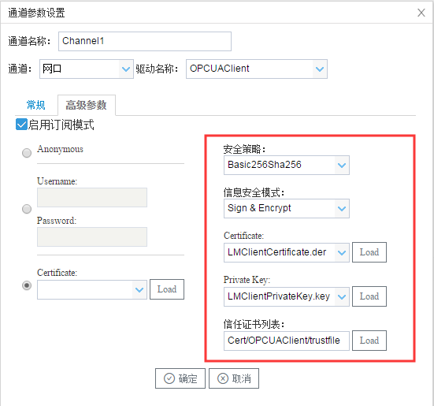
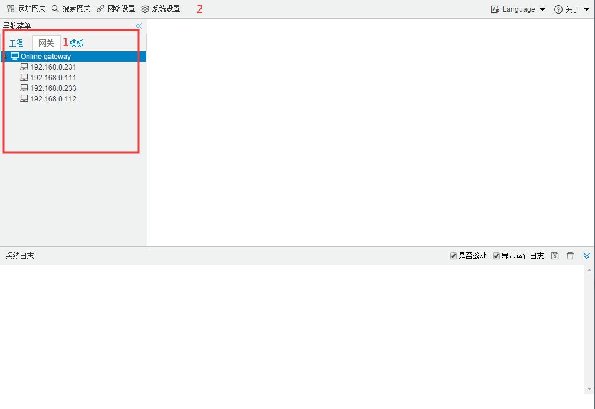
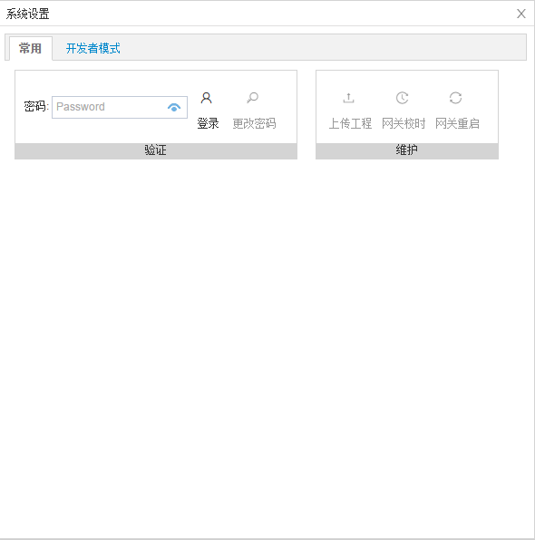
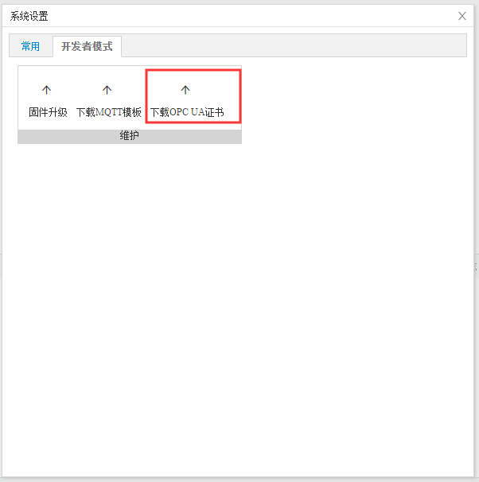

# OPCUA上传证书秘钥

### 导入证书秘钥到配置工具

在配置工具导入证书和秘钥之后，需要上传证书至网关，网关才能与OPCServer/OPCClient 正常通信。

当“安全策略”以及“信息安全模式”不为 None时，出现“Certificate”、“Private Key”以及“信任证书列表”三个文本框，点击“Load” 导入文件到配置工具内；

### 配置工具导入证书秘钥到网关

将秘钥和证书导入到配置工具完成之后，就可以进行上传网关操作。

1. 点击“网关”，选中要上传证书秘钥的网关；

2. 打开“系统设置”，出现下图弹框

   

3. 点击“开发者模式”，输入密码“luomi”，点击“确定”就，进入如下图配置界面。

   

4. 点击“下载 OPC UA证书”，确认弹框内的ip地址无误之后，点击弹框中的“确定”，即可完成配置。

注意：

1. 证书上传之后需要重启网关，配置才能生效

2. 如果"信任证书列表“ 文件夹为空，OPCUA 将默认接收所有的证书链接请求；不为空，只接受 "信任证书列表“ 中存在的的证书链接请求。

3. 我们已经在配置工具内存放 OPCUAClient和Server的证书和秘钥。配置时，在”安全策略“选择”Basic256Rsa256“,”信息安全模式“选择”Sign”或者“Sign & Encrypt ”,点击“确定”，就可以使用。

   

