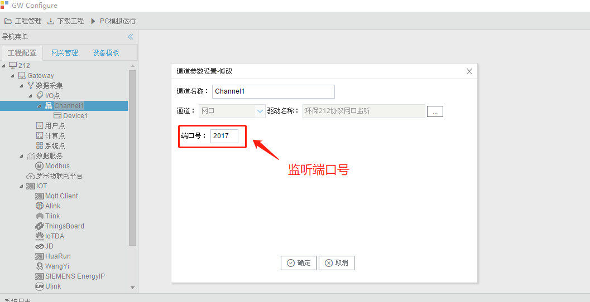
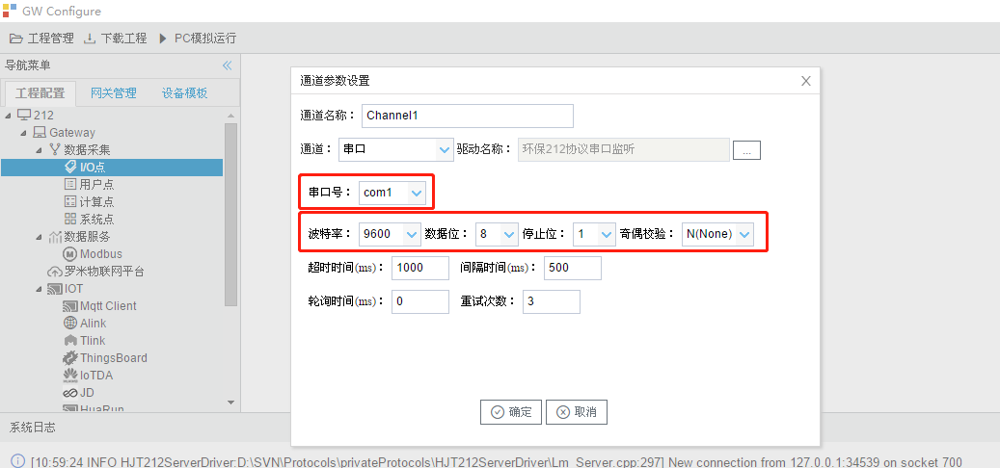
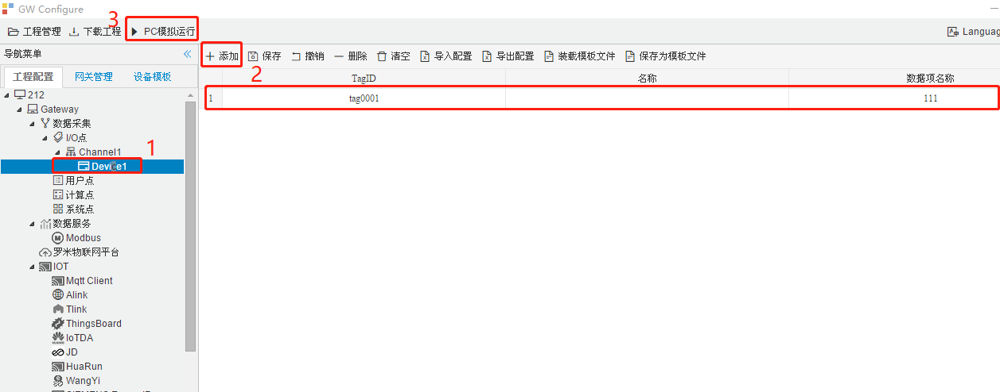
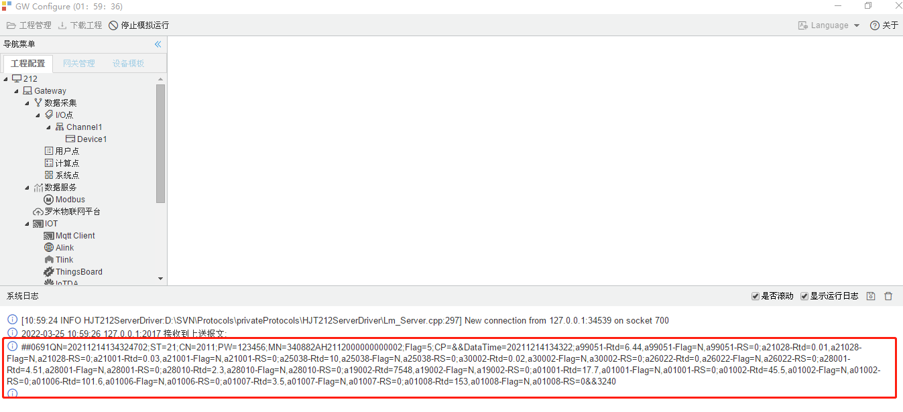
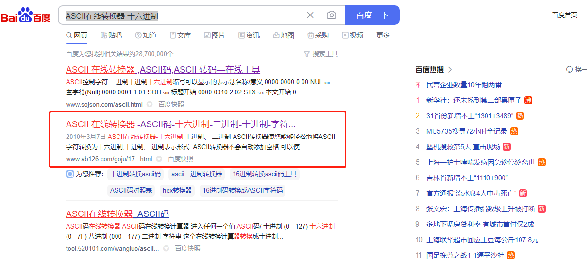
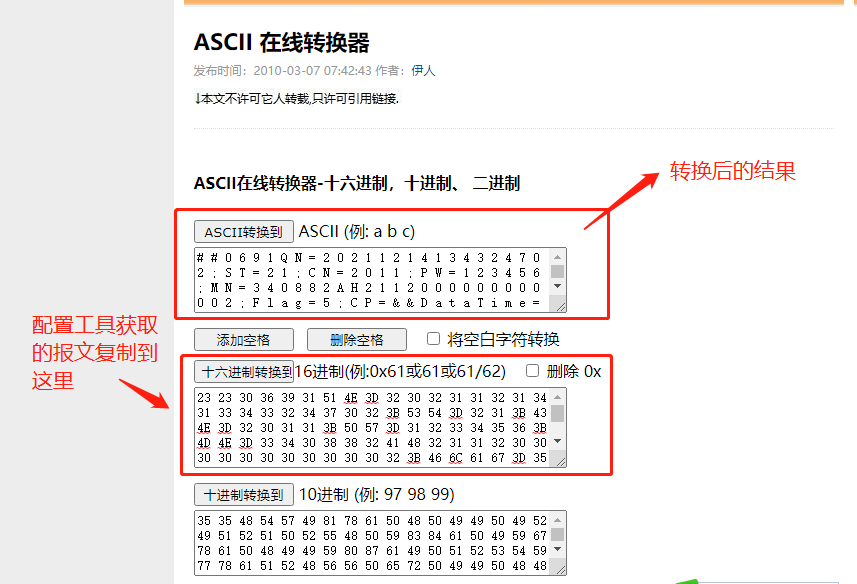
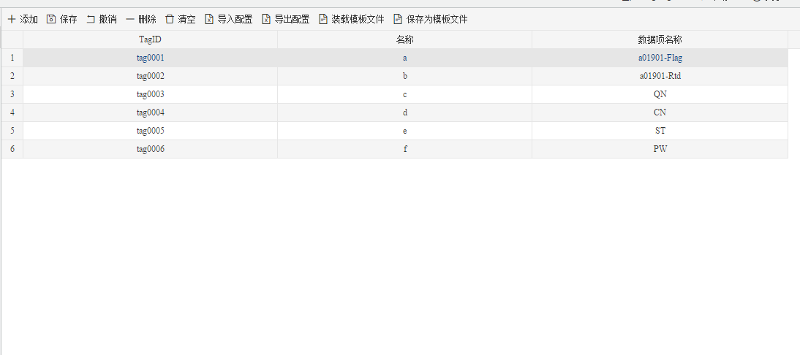

## 4.编辑采集点表

**环保212协议网口监听协议：**双击通道可以看到监听的端口号，把本机IP和端口号在设备端配置好。

**环保212协议串口监听协议：**双击通道可以看到监听的端口号，把串口参数在设备端配置好。

新建一个设备，然后在设备里随便添加一个点，再点“PC模拟运行”。

网口监听到设备发过来的报文，从报文中可以获取数据项名称（报文中“=”号左边的名称）。

串口监听到设备发过来的报文为ASCII码十六进制代码，需要把它转成字符。

在百度上搜索”ASCII在线转换器-十六进制“，选择一个在线转换器。

从转换后的结果中可以获取数据项名称（报文中“=”号左边的名称）。

在配置工具中设置采集点的数据项名称，点击"Device1"，出现采集点配置界面，

- TagID：可自定义，默认为  tag0001,tag0002依次递增，根据需要修改，设备采集点表内，TagID不可重复；
- 名称：可自定义，描述信息，根据需要填写，可不填；
- 数据项名称：根据上传报文，填入需要显示的字段名，字段名根据《污染物在线监控（监测）系统数据传输标准》填写，比较常用的格式是xxxxxx-Rtd，表示实时数据，xxxxxx是污染物编码；或者根据上送报文来填写，等号左边对应**数据项名称**。

如下图所示

