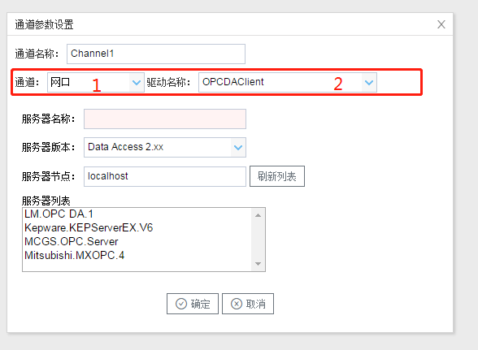

## 2.新建驱动

通道参数设置页面，在"通道"选择"网口"，在"驱动名称" 选中"OPCDAClient"。如下图2-10-2所示

  图2-10-2 通道参数设置	

接着开始配置通道的采集信息，"OPCDAClient"默认配置是：

- 通道名称：Channel1，可自定义，不可重复，定义网关的采集通道；
- 通道：网口和串口两个选项，该驱动选择网口；
- 驱动名称： 选中"OPCDAClient"
- 服务器名称：可在 "服务器列表"中选择；
- 服务器版本："Data Access 1.0a" "Data Access 2.xx"  "Data Access 1.0a"  根据需要选择；
- 服务器节点：输入IP地址后，点击刷下列表 ，即可刷新 "服务器列表"

点击"确定"后，菜单栏"I/O点"下会新增通道"Channel1"，如下图2-10-3所示

 图2-10-3 Channel子菜单栏
