## 4.编辑采集点表

点击"Device1"，出现采集点配置界面，

- TagID：根据需要修改，每个DAClient采集点的唯一标识；

- 名称：根据需求填写，可不填

  有两种方式添加采集点：使用 "搜索" 功能添加采集点；使用 "添加" 功能添加采集点；

  ###### **使用 "搜索" 功能添加采集点**

如下图2-11-7.1 所示  点击"搜索" 后，出现当前可采集的全部 tag点，选中采集的tag点 ，点击"添加所选"，最后点击"保存"，即可完成 采集点的配置

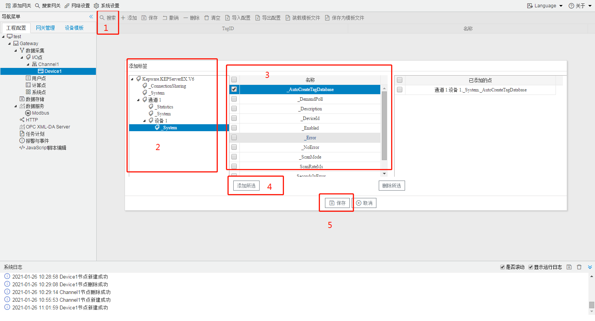

​		

图2-11-7.1 搜索tag点配置

###### **使用 "添加" 功能添加采集点**

如下图2-11-7.2 所示：点击"添加" 后，创建TagID为"通道 1.设备 1._System._AutoCreateTagDatabase"，再点击保存。

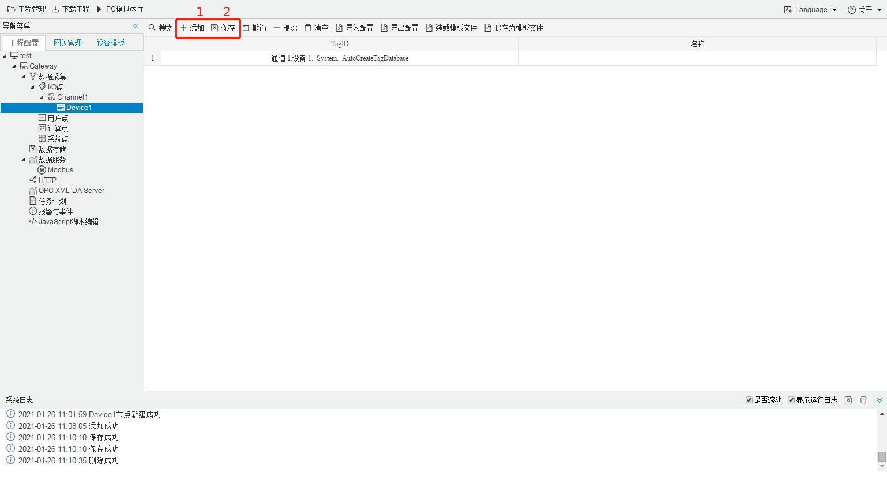

图2-11-7.2 添加tag点配置

## 名称列表不显示问题的处理方法

如下图所有，名称栏没有显示出点的列表，这时就需要手动添加采集点。

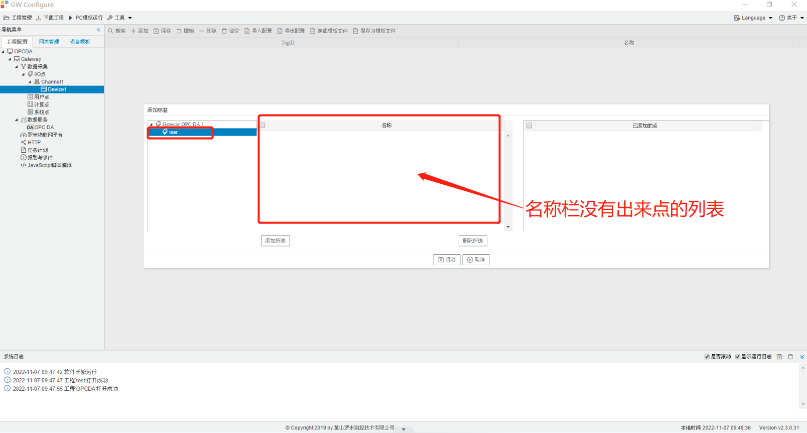

可以通过OPCDA工具，来获取采集点名称，按下列图片步骤操作。

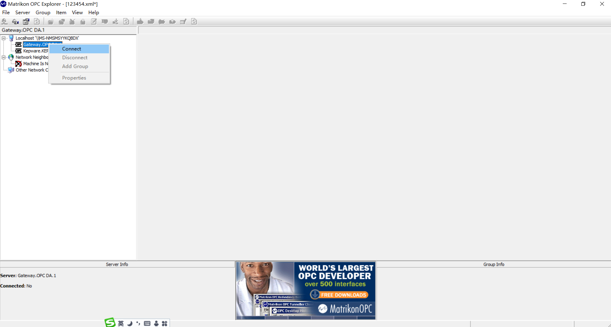

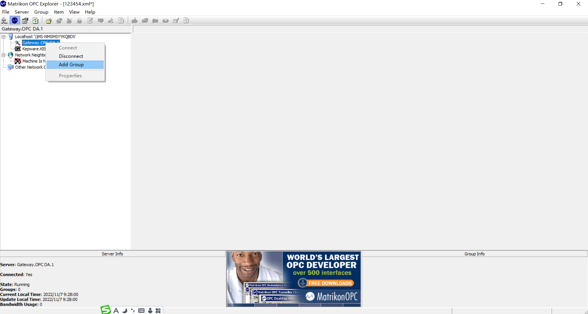

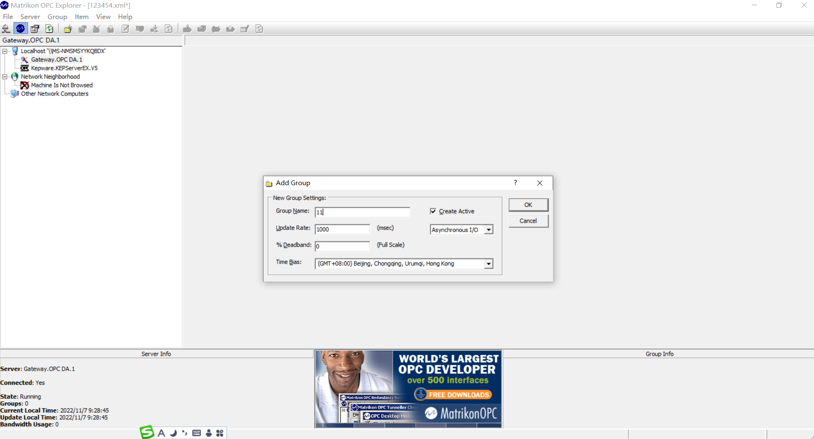

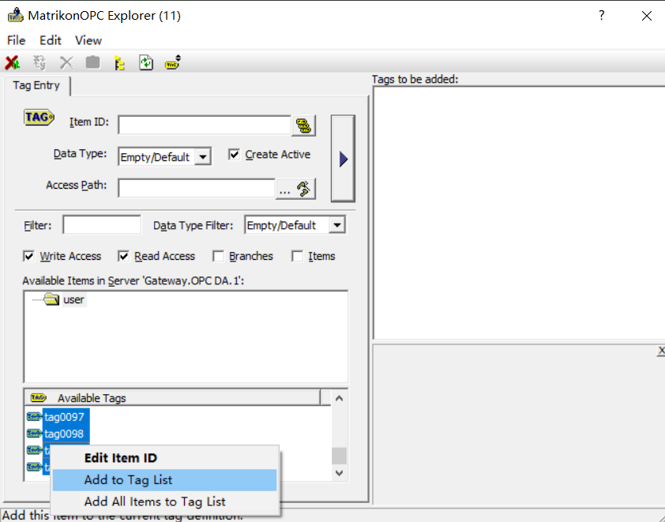

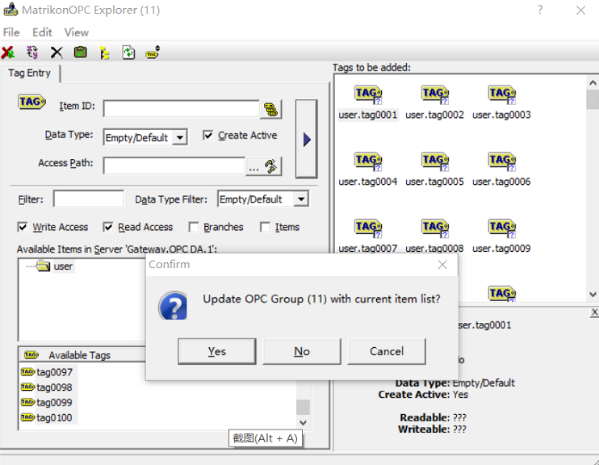

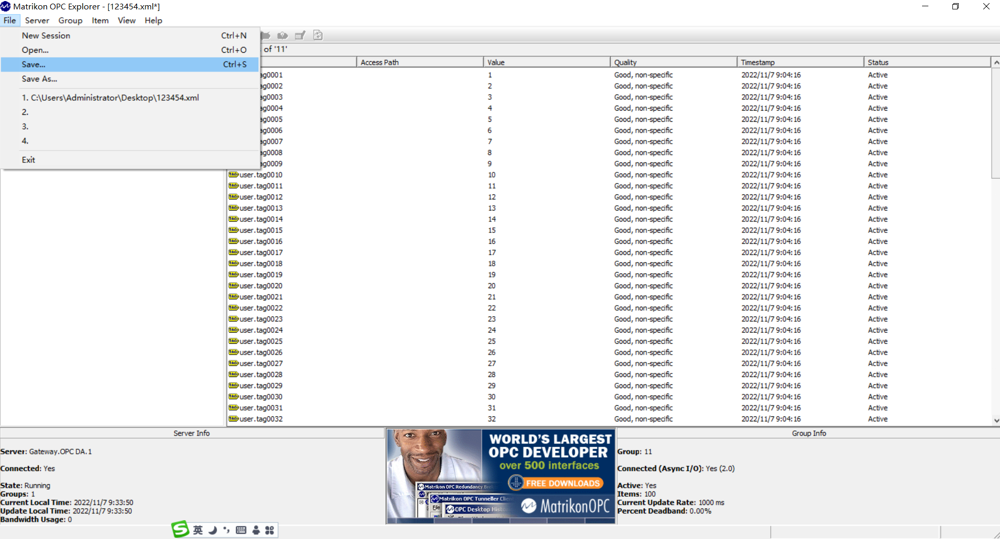

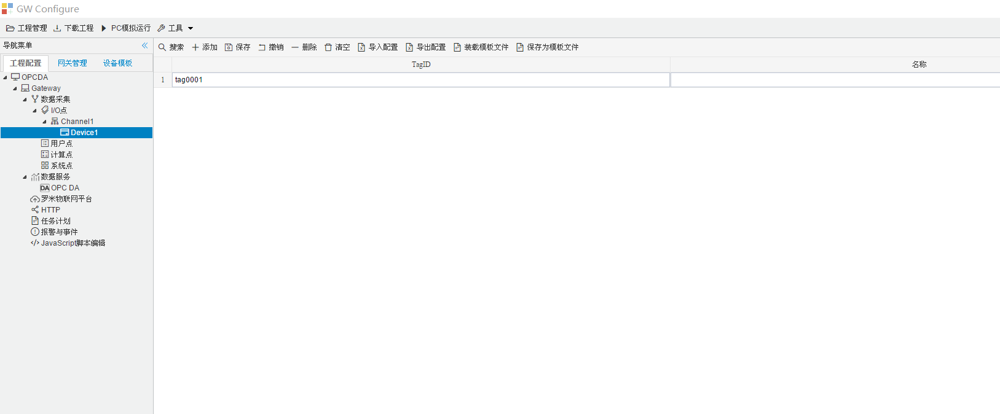

用记事本打开导出的XML文件，可以看到OPCDA的采集点名称。

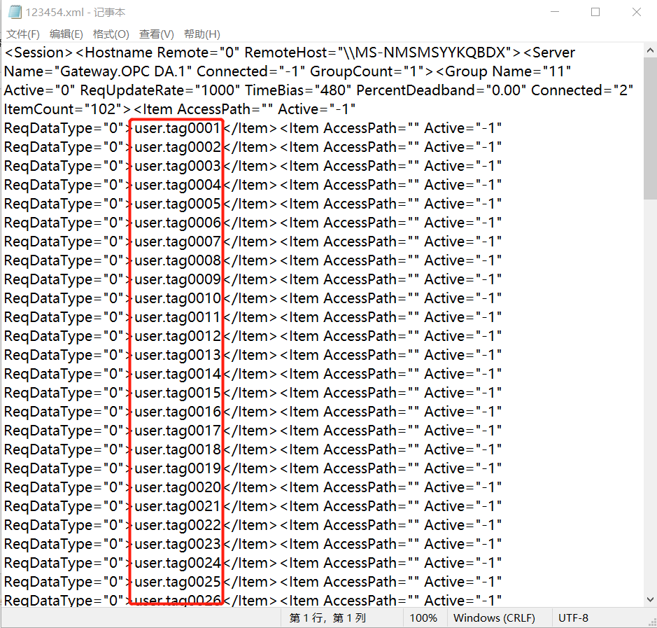

将点名称处理后，放进EXCEL里，然后再导入配置工具中。

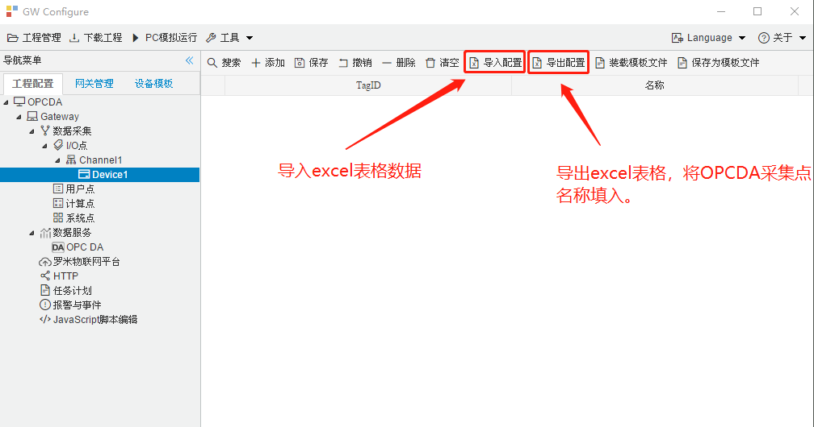