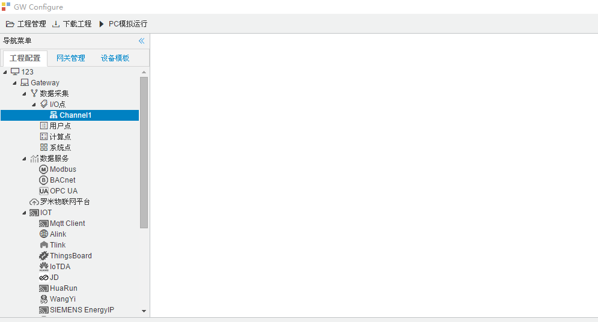

## 2.新建驱动

通道参数设置页面，在"通道"选择"网口"，在"驱动名称" 选中"OPCUAClient"。如下图2-10-2所示

  图2-10-2 通道参数设置	

高级参数设置

接着开始配置通道的采集信息，"OPCUAClient"默认配置是：

- 通道名称：Channel1，可自定义，不可重复，定义网关的采集通道；

- 通道：网口和串口两个选项，该驱动选择网口；

- 驱动名称： 选中"OPCUAClient"

- IP地址：默认为"192.168.1.1"

- 端口号：仪表的端口号，默认为4840；

- 超时时间：即为APDU超时时间。可自定义，默认500ms；

- 间隔时间：可自定义，默认500ms;

- 轮询时间：可自定义，默认为0ms;

- 重试次数：即为APDU重试次数。可自定义，默认为3

- 高级参数：

  1. 启用订阅模式：使用订阅模式后，所有采集点的值会上传一次，然后只有当采集点的值再次发生变化或者采集值时间上发生变化，才能上传。

  2. Anonymous：选中之后，启用匿名的方式连接 OPCUAServer。
  
  3. Username和Password：选中之后，在“Username”填入 用户名，“Password”填入密码。启用户名密码的方式连接 OPCUAServer。
  
  4. Certificate：选中之后，点击“Load”，导入证书的路径。启用交换证书的方式连接OPCUAServer。
  
  5. 安全策略和信息安全模式：安全策略：None，Basic256，Basic128Rsa15，Basic256Sha256；
  
     ​											  信息安全模式：None，Sign（签名），Sign & Encrypt （签名和加密）
  
     - 当 “安全策略”选中为 None时，信息安全模式必定为None。此时 ，OPCClient 和OPCServer 之间的通信将不会有加密和签名。
     - 当 “安全策略”选中为 Basic256，Basic128Rsa15，Basic256Sha256中的任意一个时，信息安全模式为Sign 或者 Sign & Encrypt。此时 ，OPCClient 和OPCServer 之间的通信将会有 签名 或者 签名和加密，提高客户端和服务器的通信安全。

点击"确定"后，菜单栏"I/O点"下会新增通道"Channel1"，如下图2-10-3所示

 图2-10-3 Channel子菜单栏
