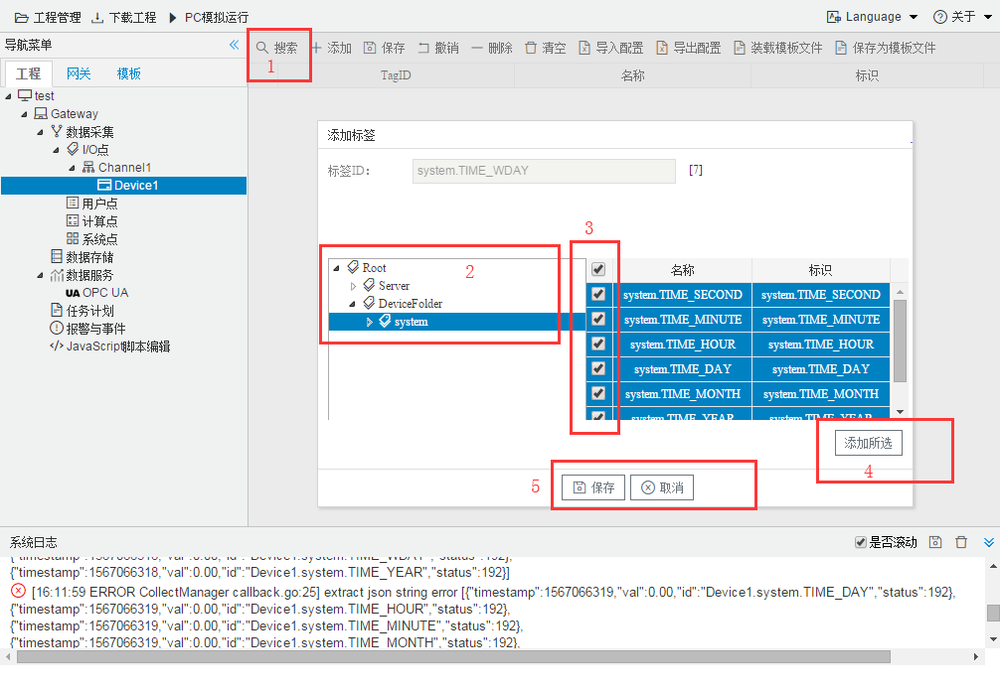
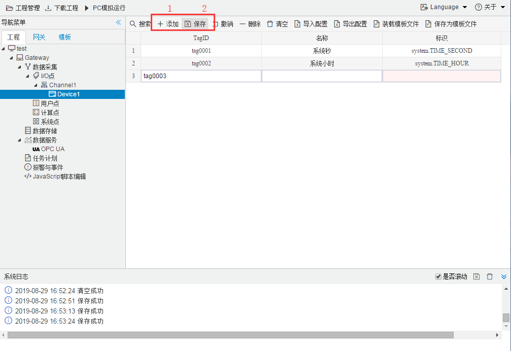

## 4.编辑采集点表

点击"Device1"，出现采集点配置界面，

- TagID：可自定义，默认为  tag0001，根据需要修改，设备采集点表内，名称不可重复；

- 描述：可自定义，描述信息，根据需要填写，可不填；

- 标识：每个UAClient采集点的唯一标识；

  有两种方式添加采集点：使用 "搜索" 功能添加采集点；使用 "添加" 功能添加采集点；

  ###### 使用 "搜索" 功能添加采集点

如下图2-10-7.1 所示  点击"搜索" 后，出现当前可采集的全部 tag点，选中采集的tag点 ，点击"添加所选"，最后点击"保存"，即可完成 采集点的配置

​		

图2-10-7.1 搜索tag点配置

###### 使用 "添加" 功能添加采集点

如下图2-10-7.2 所示：点击"添加" 后，创建TagID为"tag0001"；名称为"系统秒"；标识地址为"system.TIME_SECOND" 的采集点；TagID为"tag0002"；名称为"系统小时"；标识地址为"system.TIME_HOUR" 的采集点最后点击"保存"。

图2-10-7.2 添加tag点配置
