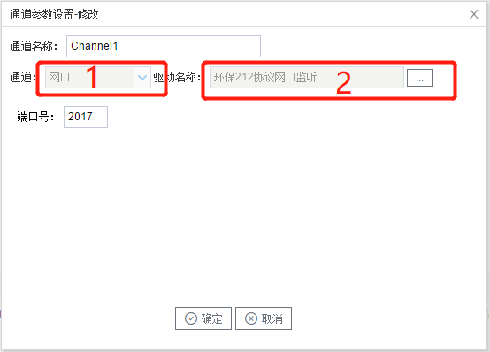

## 2.新建驱动

通道参数设置页面，在"通道"选择"网口"，在"驱动名称" 选中"环保212协议网口监听"。如下图2-10-2所示

  图2-10-2 通道参数设置	

接着开始配置通道的采集信息，"环保212协议网口监听"默认配置是：

- 通道名称：Channel1，可自定义，不可重复，定义网关的采集通道；
- 通道：网口和串口两个选项，该驱动选择网口；
- 驱动名称： 选中"环保212协议网口监听"
- 端口：默认是2017

 点击"确定"后，菜单栏"I/O点"下会新增通道"Channel1"，如下图2-10-3所示

 图2-10-3 Channel子菜单栏
